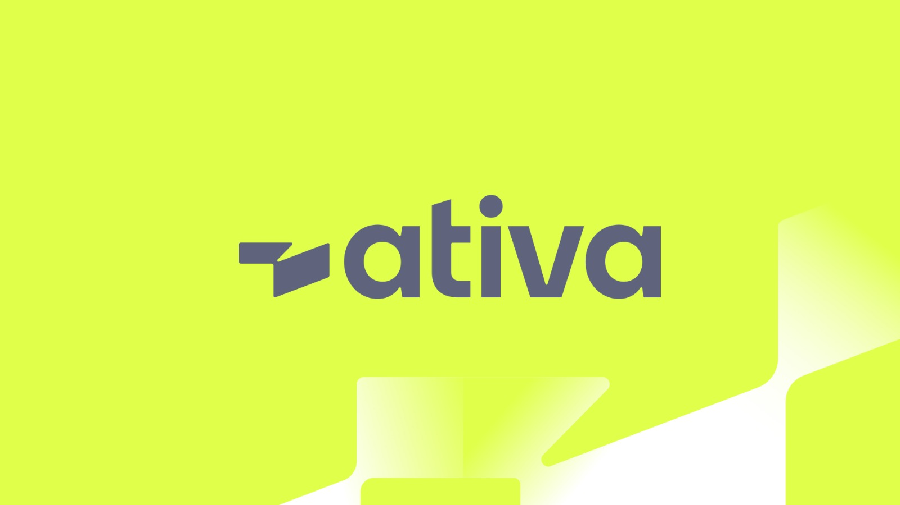

# Page usando Vue.js

<h1 align="center" >
  
</h1>

# Ativa Investimentos #timeativa - Hospedagem de site

<h1 style="font-size: 1.2rem;" align="center"><a href="https://ativainvestimentos-estagio-gabriel.netlify.app/">website view</a></h1>

Observação: Devido a ser um site de hospedagem gratuita, pode haver limitações no funcionamento correto de elementos e imagens. No entanto, você pode baixar o conteúdo e testá-lo em seu computador, onde deverá funcionar normalmente.

### Clone esse repositório

<pre>
$ git clone https://github.com/GabrielAlvesGit/AtivaInvestimentospages
</pre>

### Entre no diretório do projeto

<pre>
$ cd handleClick
</pre>

### Instale as dependências

<pre>
$ npm install  
</pre>

### Inicie o projeto com o comando

<pre>
$ npm run dev
ou
$ yarn start 
</pre>

## 💻 Layout

Este site é desenvolvido sem a utilização de JavaScript convencional, em vez disso, emprega Vue.js e CSS para fornecer uma experiência de usuário única e eficiente.
